# 1. Introduction

### 1.1. Purpose
This document describes the Document management project's functionalities. It contains information about system architecture, database design and other software design decisions.

### 1.2. Scope 
This project is a web application designed to store templates for the creation of company documents. Currently, all company documents are archived in a physical form and are hard to organize and take a lot of place. 

This application allows the client to have an organized repository of templates at hand, manage responsibilities for said templates, version them and view the archived ones.

It also enables the client to manage notifications for the templates that are due for editing/updating through setting alarms.

### 1.3. Overview

In the following sections this software is outlined in the higher detail:

* Section 1:    Introduction
* Section 2:    System Overview
* Section 3:    System Architecture Description
* Section 4:    Database Design
* Section 5:    Human Interface Design
* Section 6:    Version history

### 1.4. References
None.

# 2. System Overview

### 2.1. Constraints
The system will only be accessed on a local network.
Website is implemented using PHP (Phalcon) for back end logic, MySQL for database, HTML and CSS together with Bootstrap for front end design and Elasticsearch for search.

### 2.2. System environment
Server system needs to support all the technologies mentioned under 2.1., while the client needs a standard web browser.

# 3. System Architecture Description

### 3.1. Overview of modules
The following is the list of the modules:        
    
**User Management**
_____
1. **Login**
    * Handles user authentication. 
    * Automatic logging in in case user wanted to be remembered.
2. **Logout**
    * Logs out the user.
3. **Admin panel**
    * Allows administrator to view and edit user info and create new users.
    
**List**
_____
1. **Templates**
    * This component lists all templates of the given category sorted by the set parameter. 
2. **Template history**
    * This component allows for newest-first listing of previous versions of one template.
3. **Alarms**
    * This component lists all alarms that are assigned sorted by upcoming first.
4. **Audits**
    * This component lists all events that happens in application.
5. **Users**
    * Viewing other users is available only to users with adequate permissions.

**View**
_____
1. **Template (current version)**
    * Shows information about template 
    * Allows for template download, edit, history, approvals and shows relevant alarms.
2. **Template (previous version)**
    * Minimalistic version of current version template view with only basic information about the template and an option for download.
3. **Alarm**
    * Shows all alarm data.
4. **Audit**
    * Shows all data about audit.
5. **User**
    * Shows all data about user (only for users with adequate permissions).

**Add**
_____
1. **New alarm**
    * This component is responsible for adding new alarm. User can assign.
        name for the alarm, date and exact time, link alarm to one template,
        leave a comment and add people that should be notified. 
2. **New template**
    * This component is responsible for adding new document template. 
        User can upload a document template in several formats, link 
        appropriate category to the document, add an alarm and assign 
        people responsible for the document.
3. **New user**            
    * This component is responsible for adding new users and assigning privileges. Available only to administrator(s).

**Other**
_____
1. **Menu/categories**
    * This component is responsible for choosing different categories of document templates.
    * Supports multiple category sub levels.

       
### 3.2. Functional Decomposition Tree
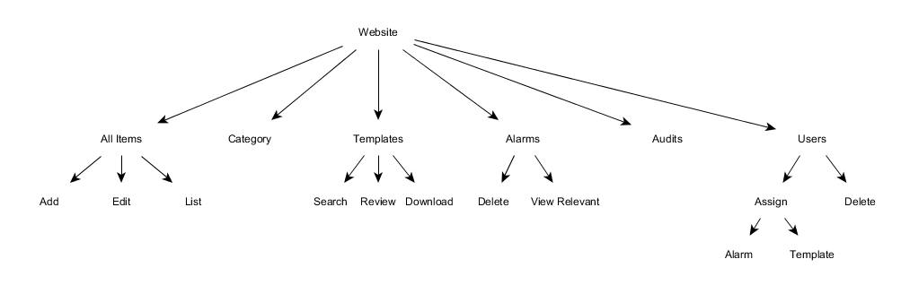

### 3.3. Activity Diagram
Activity diagram describes workflow of activities and actions.   

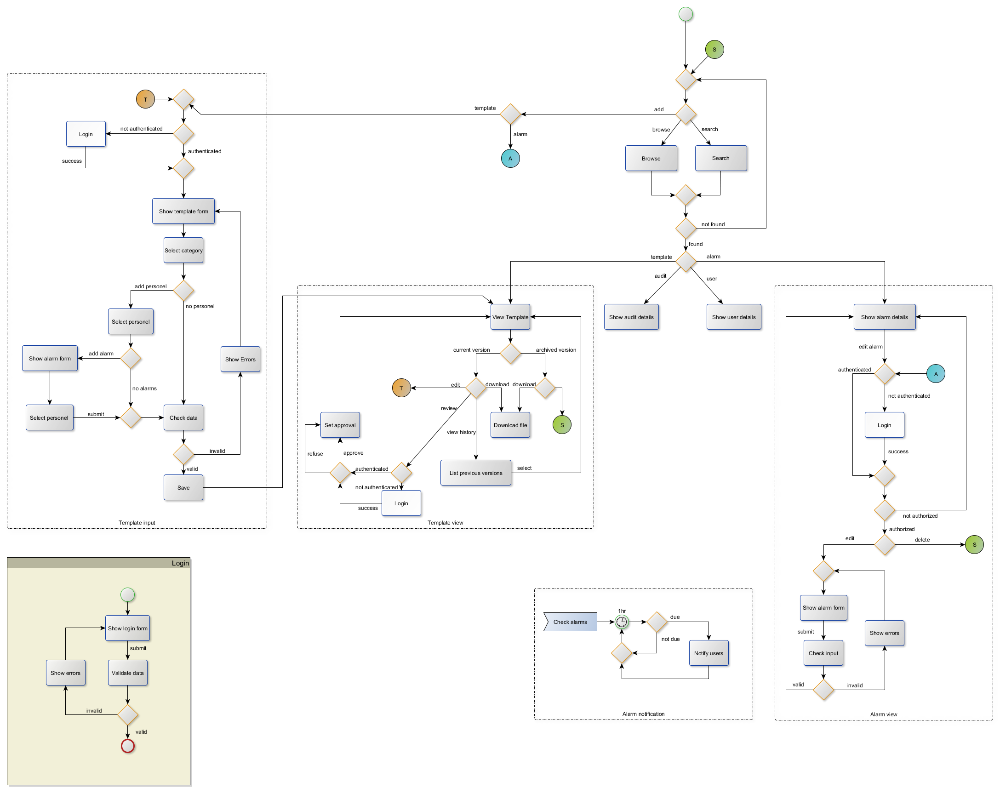

User can add, browse and search items. Templates and alarms can be added while all other components (templates, alarms, audit and users) can be browsed and searched. Browsing templates redirects user to "template view" component, browsing alarms redirects user to "alarm view" component, browsing audits shows audits details and browsing users shows users details. Adding a template redirects user to "template input" component while adding alarm redirects user to "alarm view" component.

In *login* component user is shown a login form that has to be filled. After submitting the form data is validated. If submitted data is invalid errors are shown to user and he is redirected back to login form. If data is valid user is successfully logged in.

In *template input* component user authentication is checked first. If user is not authenticated, he is shown a "login" component. If he is authenticated, template form is shown. User is obligated to select a category for a template while adding an alarm and personnel is optional. After submitting data is validated before saving and user is redirected to "template view" component.

*Template view* component has two different versions, a current one and an archived one. An archived version can only be viewed and downloaded. Current version can be edited, reviewed and downloaded. From the current version screen user can also view previous template versions. If user chooses to edit a template, he is redirected to "template input" component. If user chooses to review template, authentication is checked and if it's valid he can approve or refuse a template. 

In *alarm view* component alarm details are shown and user can edit or delete them. If user wants to edit an alarm, authentication is checked. If user is not authenticated, he is redirected to "login" component. If he is authenticated, alarm form is shown. After submitting the form data is validated.

In *alarm notification* component alarms are checked and 1 hour before alarm deadline user is notified. 

    
## 4. Database design
### 4.1. Database ER Diagram

### 4.2. Data dictionary
____
**Common**
____

| Field        | Type |
| ------------- | ------------- |
| id | int(11)
| guid  | varchar(45)  |
| created_at | timestamp  |
| updated_at | timestamp  |
____
**Table: Alarm**
____

| Field        | Type |
| ------------- | ------------- |
| name | varchar(45) 
| date | datetime
| comment | text
____
**Table: Category**
______
| Field | Type |
| ----------- | ------------ |
| name | varchar(45) |
| parent_id | int(11) |
____
**Table: Role**
______
| Field | Type |
| ----------- | ------------ |
| name | varchar(45) |
| description | text |
____
**Table: Template**
______
| Field | Type |
| ----------- | ------------ |
| current_version | int(11) |
____
**Table: Template Details**
______
| Field | Type |
| ----------- | ------------ |
| name | varchar(45) |
| number | varchar(45) | 
| tag | varchar(45) |
| mime | varchar(45) |
| file | varchar(45) |
| version | int(11) |
| thumbnail | varchar(60) |

____
**Table: User**
____
| Field | Type |
| ----------- | ------------ |
| name | varchar(45) |
| email | varchar(45) | 
| password | varchar(45) | 
| admin | tinyint(1) | 

## 5. Human Interface Design 
This section briefly describes the interfaces and interface components of document management.

### 5.1. Login Screen 
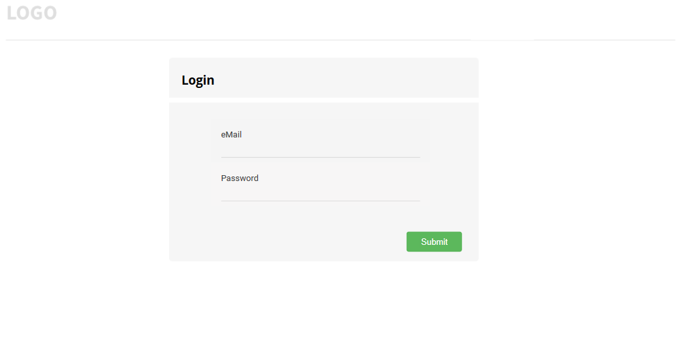

This screen is the first screen visible to the user that is not logged in.
User is required to enter his valid email and password in order to successfully log in. After a login user is redirected to Template List Screen(5.2).   

### 5.2. Template List Screen
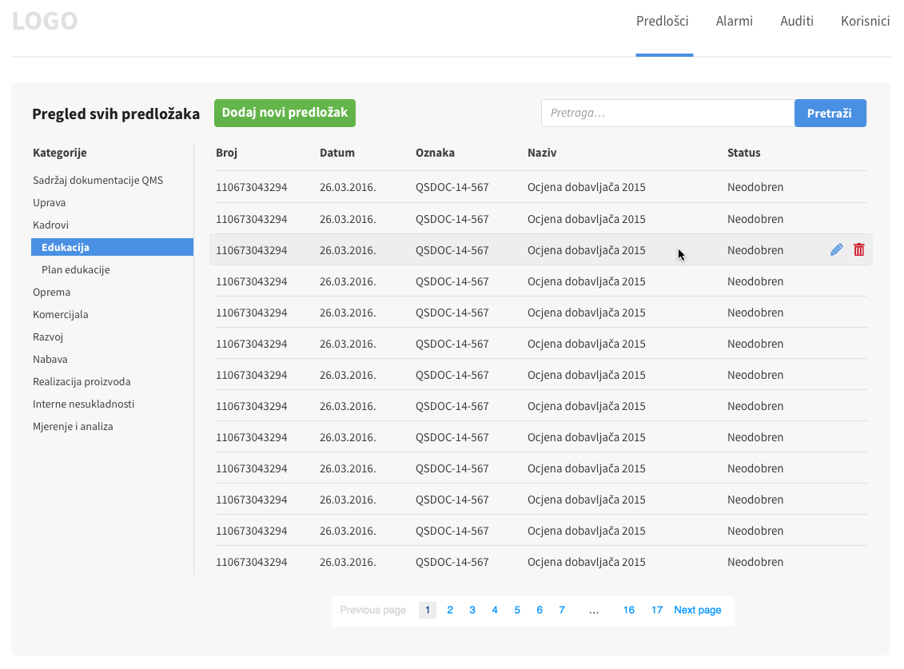

This screen is the first screen to be visible to the user once logged in. Apart for the header that is common for the whole website and contains navigation, to the left there is a list of all the template categories. If the selected category has sub-categories clicking on the category name shows those categories in the area below the clicked item. If the selected category doesn't have any sub-categories clicking on category name leads the user to the identical screen to this one, albeit with templates only from the chosen category.
Above the template list is "Add new template" button that leads to Template Create Screen (5.9) and a search field for performing global search. 
Template list contain basic template information to help user identify the wanted template. Hovering over the item on the list makes edit and delete icons appear. Clicking on the edit icon leads to Template Edit Screen (5.4) and clicking on the delete icon shows a pop-up dialog asking user to confirm the action.

### 5.3. Template View Screen
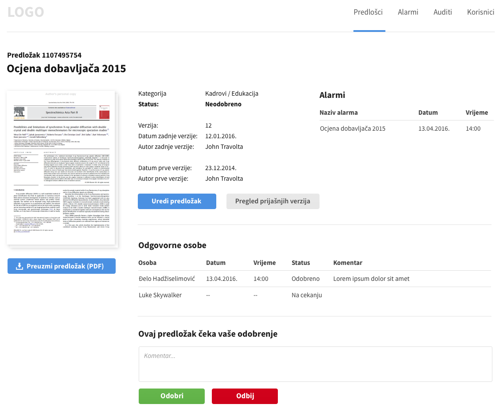

Template view screen contains all the data about the template and provides links that allow user to download template, edit template, view template's history or approve/disapprove the template. Editing the template is only allowed for responsible personnel and administrator. 

### 5.4. Template Edit Screen
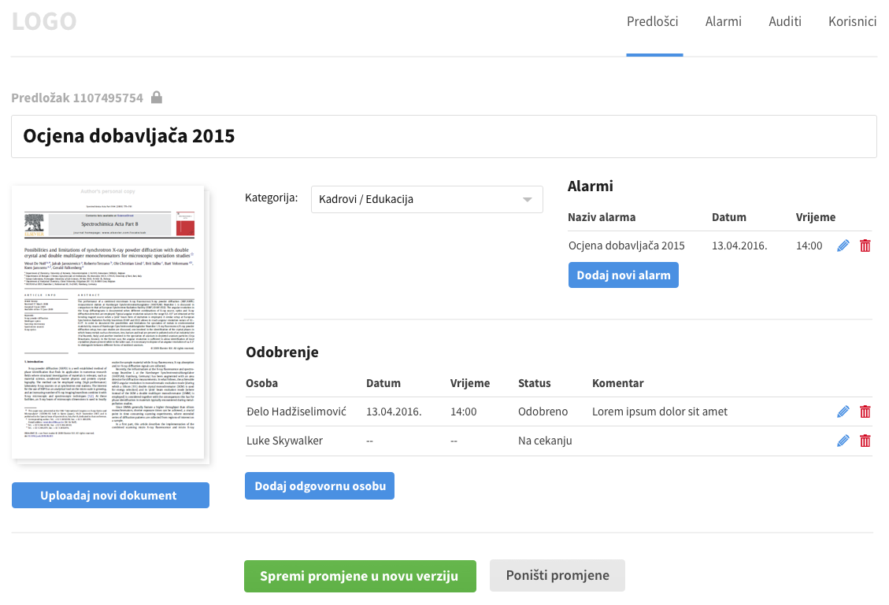

Template Edit Screen is very similar to Template Create Screen (5.5) but instead of empty screen loads already existing data for the template user is editing. It allows actions such as uploading a new document, changing category, changing name, adding or changing alarms and changing responsible personnel. Only field that is not changeable is the id of the template.
Clicking on "Save changes to a new version" creates a new version of the same document, where the previous version is archived and available by clicking on template history button under Template View Screen (5.3).

### 5.5. Template Create Screen
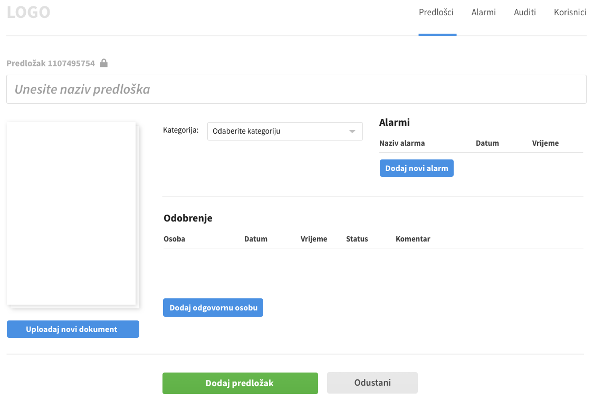

Allows for creating of new template and alarms for it. On the left there is a "Upload new document" button which opens a file system browser for user to select a template for upload. Once the template is uploaded a first page of the document appears as a preview icon above the button (in case the format is supported). In case the format is not recognized a universal generic icon appears instead of preview.
Category menu allows user to select on of the already defined categories.
Adding a new alarm creates a pop-up with a simplified new alarm form. After new alarm is created it is added on the alarm list under "Alarms".
Adding a new responsible person creates an empty row under the "Approval" heading where user can select the person from already existing user list that appears as a drop-down menu. Date and time are automatically assigned, status is set to false by default and comment can be left empty. Clicking on "Add template" button leads to Template View Screen (5.3) for the newly created template while cancel button leads to Template List Screen (5.2).

### 5.6. Audit List Screen
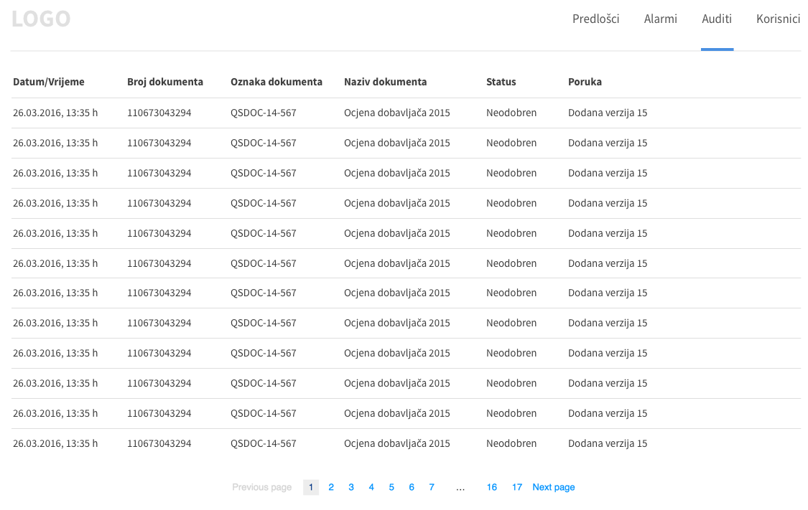

Audit List Screen is intended as a log that shows actions that happened over time. Can be used to monitor what and when something has happened. Items in the list are not clickable.

### 5.7. Alarm List Screen
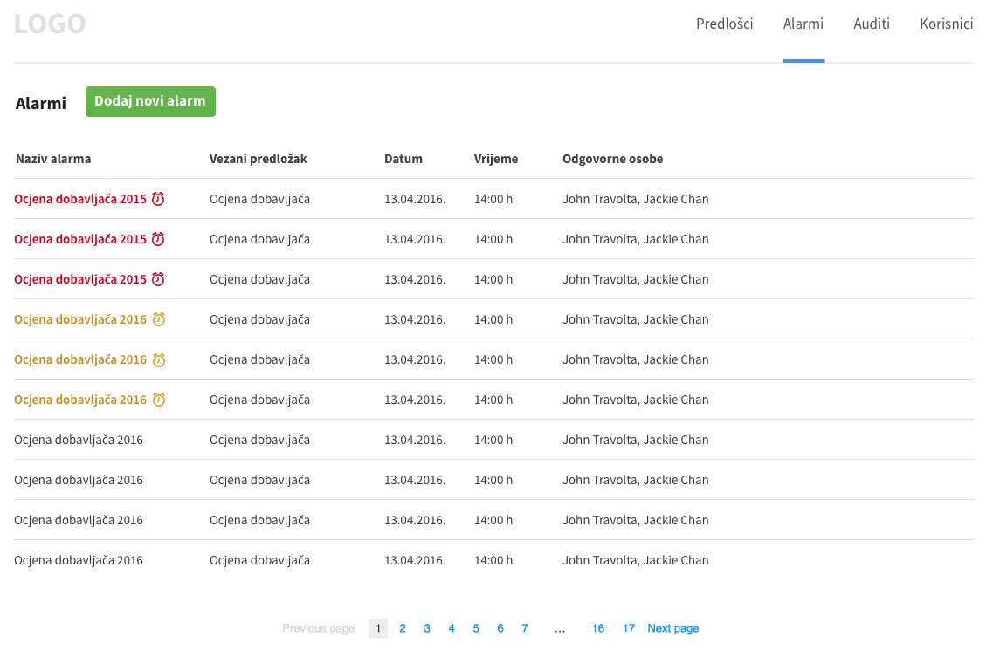

Shows a list of all alarms that are relevant to the user in a descending order where the first alarm is also the most urgent one (is due first). List shows name of the alarm, related template if it exists, date and time and responsible personnel. Clicking the alarm shows all the details for that alarm.

### 5.8. Alarm Add Screen
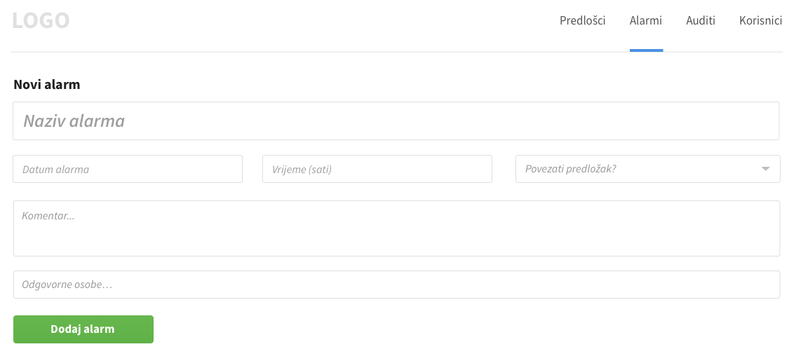

This screen allows user that has privileges to add an alarm that notifies included personnel about an event (deadline, action needed, etc.). Apart from setting time when the alarm goes off (show up as a notification), user can add a comment and a relevant template that the alarm is about. Both are optional.

### 5.9. User List Screen 
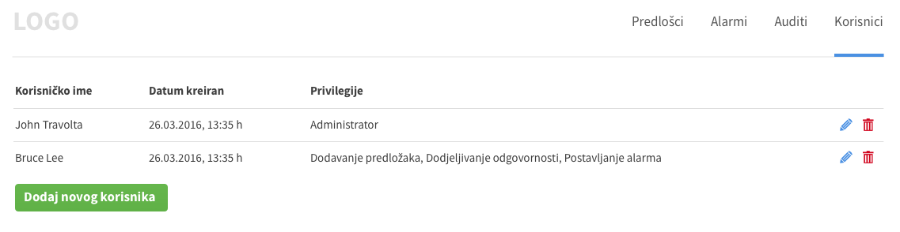

User list screen is only intended for the administrator of the system. It allows insight into date when user was created, shows privileges of the user and allows administrator to edit permissions for the user or delete the user.
There is also an option for adding a new user which is also the only way a user can be registered into the system - by the administrator.

### 5.10. User Create Screen

User Create Screen is only intended for the administrator of the system. It allows creation of the new user and assigning permissions for the user.
Screen contains a form that should be filled with user information(name, email, password and permissions). 

Permissions a user can have:
* adding and deleting templates
* adding alarms
* adding responsible personnel
* adding categories
* adding other users and managing their permissions

Administrator has all permissions.

## 6. Version history

